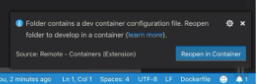
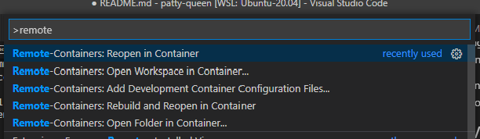
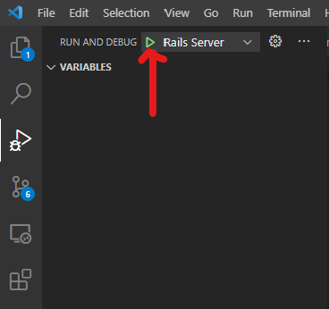

# Development Environment 

There are a few different ways to set up your environment:

1. Using Docker + VS Code + Remote Container extension
2. Using Docker Compose via command line
3. Running Rails directly via command line

Notes if using Docker (options 1 or 2): 

- You will need to have Docker already installed on your local machine. If you don't already have it installed, please use option 3 - it isn't necessary to learn a new tool (although it's very handy) for this exercise.
- If you are getting errors when trying to install Ruby gems related to being out or memory, you may need to increase the allowed amount of memory used by Docker. 

### Using Docker + VSCode + Remote Container extension

Open the root of this project in VS Code. If it is not already installed, you will be prompted to install the [Remote-Containers](https://marketplace.visualstudio.com/items?itemName=ms-vscode-remote.remote-containers) extension.

Once installed, VS Code will recognize a dev container configuration (in `./.devcontainer`) and ask to open the project in a container (which you should do!):

You can also open the command pallete (`CMD/CTRL + SHIFT + P`) and select `Remote-Containers: Reopen in Container`

After opening the project in a container you can access a shell inside the running Docker container (with `bundle`, `gem`, and `rails` installed) using the built-in Terminal.

To run the Rails application, use the `Run and Debug` panel on the left and click the green play button (or use `Run > Start Deugging` or `F5`) to start the Rails app with the built-in debugger.

All the usual Rails output will be in the `Debug Console` tab at the bottom, near `Terminal`

You should now be able to access the app at `http://localhost:3000`.

### Using Docker Compose via command line

To run the main Rails application container (`app`) 

    docker-compose up

You can also run the container in the background using 

    docker-compose up -d 

And view logs for each container in a separate shell using `docker-compose logs`. For example:

    # Use the -f flag to tail the logs
    docker-compose logs -f app

To start a bash session inside the running Rails app container run:

    docker-compose exec app /bin/bash

Here you should have access to `bundle`, `gem`, and `rails`.

#### Finishing Up 

1. Open a session inside the running app container.
2. Initialize the sqlite database: `rails db:setup`
3. Start the Rails server: `rails server`

You should now be able to access the app at `http://localhost:3000`.

### Running Rails directly via command line

Ensure you have Ruby 2.7.2 installed. (Other versions may work, however this has only been tested on 2.7.2) and [Bundler](https://bundler.io/) (e.g. `gem install bundler`).

Next, install all gems via Bundler:

    bundle install

#### Finishing Up 

1. Initialize the sqlite database: `rails db:setup`
2. Start the Rails server: `rails server`

You should now be able to access the app at `http://localhost:3000`.

## Notes 

- This project was created using the following command: `rails new . --skip-spring --skip-listen --webpacker=react`
- This is meant to (hopefully) keep the amount of set up and configuration needed to start on the assignment to a minimum. Feel free to add any gems, npm packages or other tools that will be helpful!
- We are always improving our projects, so please share any feedback or suggestions on your experience.
